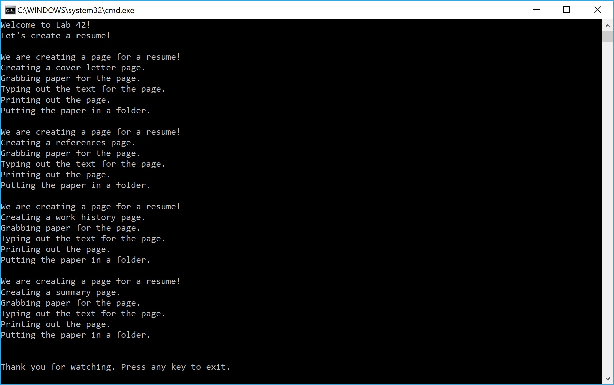

# Lab42-Design-Patterns
CODE: Design Patterns assignment for Code Fellows 401 C#/ASP.NET course

**Author**: Earl Jay Caoile  
**Version**: 1.0.0

## Overview
This console app demonstrates the Factory Method Design Pattern by 
creating pages in a resume.

## Getting Started
The following is required to run the program.
1. Visual Studio 2017 
2. The .NET desktop development workload enabled
3. No External NuGet packages are required for this application. 

## Example

## Happy Path
 - open application in Visual Studio
 - start console app by pressing green play button
 - read data
 - close app and smile

## Architecture
This application is created using ASP.NET Core 2.1 Console applicaitons.  
*Language*: C# (version 7.3)  
*Type of Applicaiton*: Console Application  

## Change Log
06-10-2018 2:00 PM - initial scaffolding
06-10-2018 3:45 PM - finished program
06-10-2018 4:10 PM - finished readme